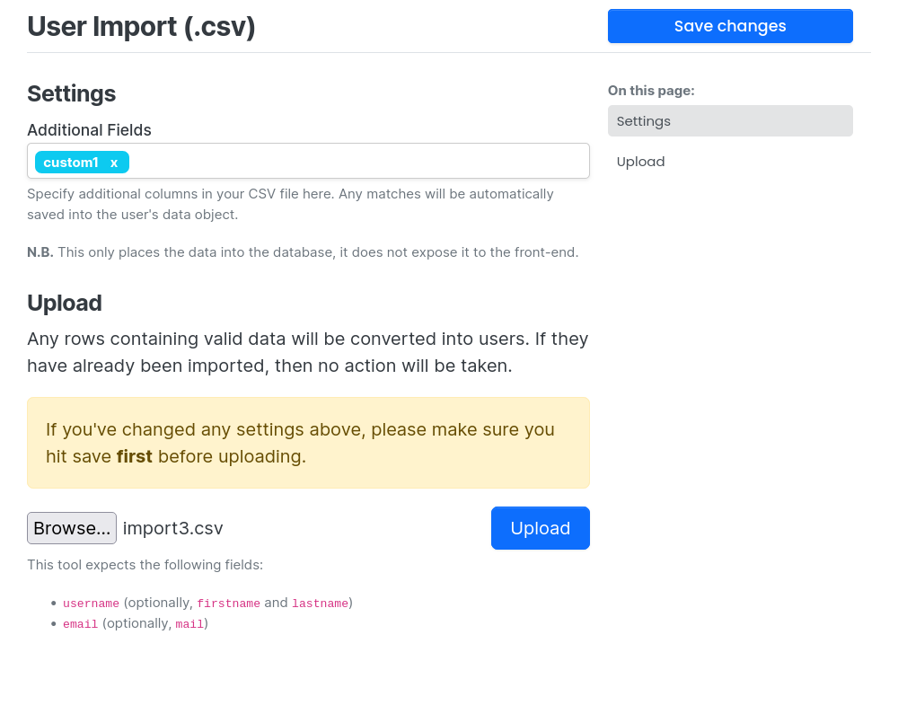
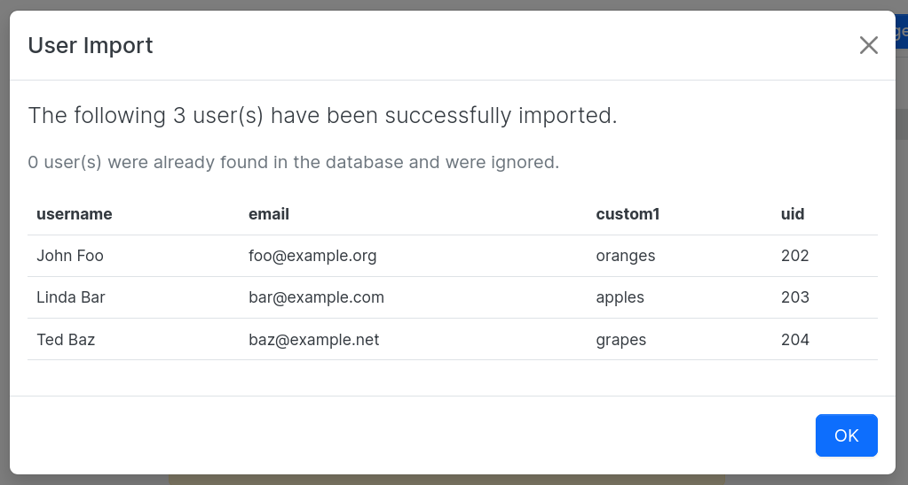

# Import Users via CSV

This plugin exposes a new admin page and endpoint for automatically creating users in the NodeBB instance via CSV upload.

Required fields are one of `username` or `firstname` (`lastname` is automatically appended if present), and `email`.

Additional fields can be present in the CSV file, but are ignored, unless explicitly specified via the admin panel.
If an additional field is specified, then it will be saved into the user's hash.

## Installation

There is an identically named package not under the `@nodebb` scope, be sure to install the properly scoped plugin instead:

    npm install @nodebb/nodebb-plugin-import-users-csv

## Screenshots





## Plugin Hooks

This plugin fires off a single hook when user import has completed. To use it, listen for the `action:importUsersCSV.created` hook, e.g.

``` js
const plugins = require.main.require('./src/plugins');

plugins.hooks.register('myPlugin', {
    hook: 'action:importUsersCSV.created',
    method: ({ uids, users }) => { ... },
});
```
